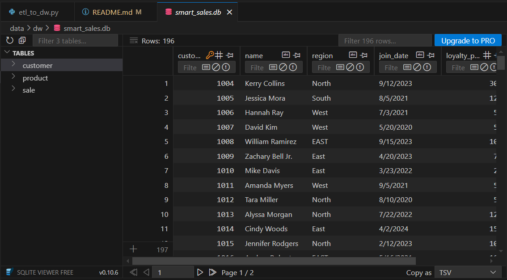
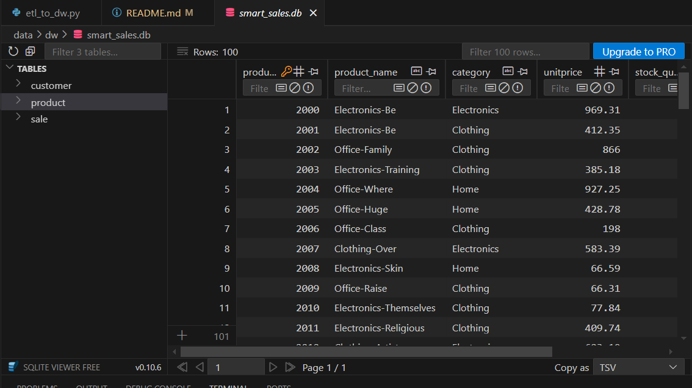
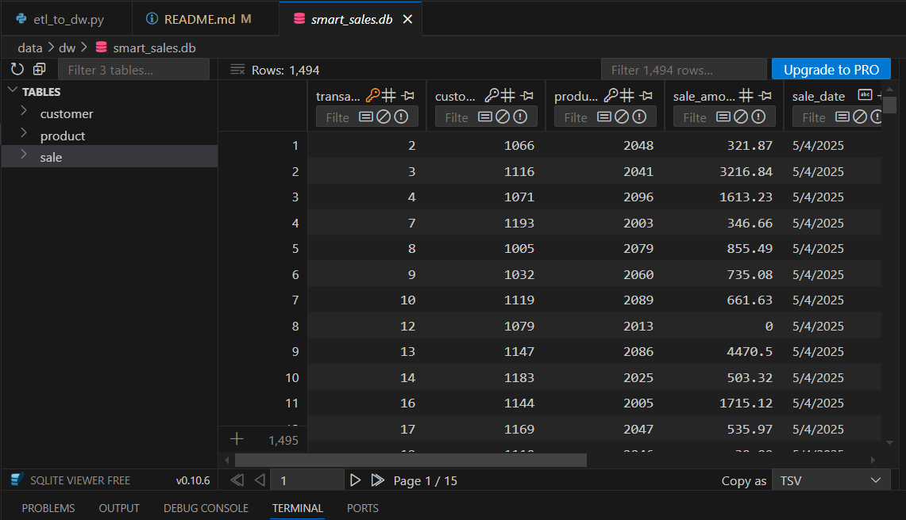
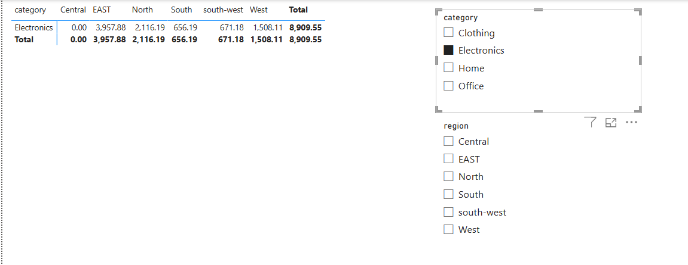

# Smart Store BI Project – Shelayne Smith
# store-smart-shelayne-smith

This Business Intelligence (BI) project showcases the full pipeline from environment setup, data preparation, OLAP cube generation, to visualization using Power BI. The goal is to identify top-performing products and stores by region and generate actionable insights.

---

## 📁 Project Repository

**Repo Name:** `smart-store-shelayne-smith`

---

## 🔧 P1. BI Python Setup & Project Initialization

### 1. Environment & Tooling Setup

* **Install**:

  * Python
  * GitHub CLI/Desktop
  * Visual Studio Code (VS Code)

* **Configure GitHub**:

  * Create new repo on GitHub: `smart-store-shelayne-smith`
  * Clone repo locally

* **VS Code Extensions**:

  * Python
  * GitLens
  * Jupyter
  * SQLite Viewer

### 2. Folder Setup

* Create project folder locally on `C:` and sync with GitHub
* Navigate to repo via: file > Open Folder > Navigate to smart-store-shelayne-smith

### 3. Virtual Environment

```bash
python -m venv .venv
.venv\Scripts\activate
```

> `.venv` contains a self-contained Python environment with its own pip, interpreter, and dependencies.

### Project Structure

```
smart-store-shelayne-smith/
├── data/
│   ├── raw/
│   │   ├── customer_data.csv
│   │   ├── products_data.csv
│   │   └── sales_data.csv
│   ├── prepared/
│   │   ├── customers_prepared.csv
│   │   ├── products_prepared.csv
│   │   └── sales_prepared.csv
│   ├── dw/
│   │   └── smart_sales.db
│   ├── logs/
│   │   └── project_log.log
│   └── olap_cubing_outputs/
│       └── multidimensional_olap_cube.csv
│
├── scripts/
│   ├── data_prep.py
│   ├── data_scrubber.py
│   ├── etl_to_dw.py
│   ├── olap_cubing.py
│   └── data_preparation/
│       ├── prepare_customers_data.py
│       ├── prepare_products_data.py
│       └── prepare_sales_data.py
│
├── tests/
│   └── test_data_scrubber.py
│
├── utils/
│   └── logger.py
│
├── .gitignore
├── requirements.txt
└── README.md
```

---

## 🔧 P2. Data Preparation and Exploration

### Logger Setup

* `utils/logger.py`: handles logging
* Output: `data/logs/project_log.log`

### Execute Scripts

```bash
py scripts/data_prep.py
```

### Version Control

```bash
git add .
git commit -m "Add data preparation script"
git push origin main
```

---

## 🔧 P3. Prepare Data for ETL

### Data Cleaning & Tests

* Script: `scripts/data_scrubber.py`
* Test:

```bash
python -m tests.test_data_scrubber
```

### Data Preparation Scripts

```bash
py scripts/data_preparation/prepare_customers_data.py
py scripts/data_preparation/prepare_products_data.py
py scripts/data_preparation/prepare_sales_data.py
```

---

## 🔧 P4. Create & Populate DW
## 🧠 Design Choices

### 📦 SQLite as the Data Warehouse
SQLite was selected due to its:

- **Simplicity** – Easy to set up and manage with no server requirements  
- **Portability** – Self-contained database that can be easily shared  
- **Lightweight Infrastructure** – Ideal for small-to-medium scale analytical projects  

This makes SQLite a fitting choice for a local, fast-prototyping BI environment.

---

### 🧱 Schema Normalization
The data warehouse schema is **normalized** into separate tables for:

- `customers`
- `products`
- `sales`

This structure:

- Reduces data redundancy  
- Improves maintainability and query performance  
- Supports flexible, multi-dimensional analysis

---

### 🧾 Column Naming Conventions
All table and column names follow the **`lowercase_snake_case`** style. This ensures:

- Consistency across the database and codebase  
- Compatibility with SQL syntax standards  
- Improved readability for developers and analysts

---

### 📅 Date Storage Format
Since SQLite lacks a native `DATE` type, all date values are stored as `TEXT` in **ISO 8601 format** (`YYYY-MM-DD`). This:

- Preserves chronological sort order  
- Ensures compatibility with SQL and Python date parsers  
- Facilitates filtering and time-based analytics

---

### 🧹 Data Preparation Workflow
Before ingestion into the warehouse:

- **Raw CSV files** are cleaned and validated  
- Column headers are renamed to match the database schema  
- **Duplicate rows** are removed to maintain integrity  
- Data types are cast appropriately to match schema expectations  

This preprocessing step ensures high data quality and consistency across all pipeline stages.

## 🗂️ Schema Implementation

The data warehouse schema follows a star design, with a central `sales` fact table and supporting dimension tables: `customers` and `products`.

---

### 🧍 Customers Table

| Column             | Type     | Description                        |
|--------------------|----------|------------------------------------|
| `customer_id`      | INTEGER  | Primary key                        |
| `name`             | TEXT     | Customer full name                 |
| `region`           | TEXT     | Geographic region                  |
| `join_date`        | TEXT     | Join date in ISO format (`YYYY-MM-DD`) |
| `loyalty_points`   | INTEGER  | Loyalty points accumulated         |
| `customer_segment` | TEXT     | Customer segment or category       |

---

### 📦 Products Table

| Column           | Type     | Description                 |
|------------------|----------|-----------------------------|
| `product_id`     | INTEGER  | Primary key                 |
| `product_name`   | TEXT     | Name of the product         |
| `category`       | TEXT     | Product category            |
| `price`          | REAL     | Price per unit              |
| `stock_quantity` | INTEGER  | Current stock quantity      |

---

### 💰 Sales Table

| Column         | Type     | Description                                 |
|----------------|----------|---------------------------------------------|
| `sale_id`      | INTEGER  | Primary key                                 |
| `sale_date`    | TEXT     | Date of sale (ISO format `YYYY-MM-DD`)      |
| `customer_id`  | INTEGER  | Foreign key referencing `customers`         |
| `product_id`   | INTEGER  | Foreign key referencing `products`          |
| `store_id`     | INTEGER  | Identifier for the store                    |
| `campaign_id`  | INTEGER  | Identifier for the marketing campaign       |
| `quantity`     | INTEGER  | Quantity sold                               |
| `total_amount` | REAL     | Total sale amount after discounts           |

---

All foreign key relationships are enforced to maintain referential integrity. Data types are selected based on usage context and SQLite's supported types.

### ETL Script

* File: `scripts/etl_to_dw.py`
* Output: `data/dw/smart_sales.db`
* Run:

```bash
python scripts/etl_to_dw.py
```
* 
* 
* 
---

## 🔧 P5. Power BI + OLAP Visualization

### Setup

1. Download Power BI
2. Install SQLite ODBC Driver
3. Configure ODBC DSN:

   * Open ODBC Data Source (64-bit)
   * System DSN > Add > SQLite3 ODBC Driver
   * Browse to `smart_sales.db`
4. Load Tables into Power BI
5. Use Advanced Editor in Power Query Editor to enter SQL
6. Create Slicer, Drilldown, and Dicing visualizations
7. Dashboard design with filters, bar charts, and matrix tables

## 📊 SQL Queries and Reporting Logic

### 🔍 Sales Filtering (Slicing)
- Sales data is **filtered to include only transactions from 2025 onward**.
- This ensures the analysis focuses on **recent sales trends** and avoids outdated insights.

### 🧮 Sales Grouping (Dicing)
- Sales records are **joined with `customers` and `products`** tables.
- Aggregations are performed on:
  - **Product Category**
  - **Customer Region**
- This **dicing operation** helps highlight **top-performing product segments** across different geographic areas.

### ⏱️ Time-Based Aggregation (Drilldown)
- Sale dates are **cleaned and parsed** using `try_to_date()` or equivalent logic.
- Sales amounts are aggregated by:
  - **Year**
  - **Quarter**
  - **Month**
- Enables **hierarchical drilldown** in time-series charts for in-depth trend analysis.

---

## 📈 Dashboard Design Choices

### 🗓️ Hierarchical Time Analysis
- The dashboard includes **interactive drilldown charts**:
  - Start at yearly trends
  - Expand to quarters and months
- Allows stakeholders to **explore patterns across different time granularities**.

### 🌍 Customer & Product Segmentation
- Sales are grouped by:
  - **Product Category**
  - **Customer Region**
- This provides insights into **key market segments** and **regional performance**.

### 🧼 Clean, Readable Visuals
- Applied best practices in chart design:
  - **Rotated x-axis labels** for clarity
  - **Consistent color schemes** for comparisons
  - **Legend placement and labeling** for readability

### 🆕 Focus on Recent Data
- All visualizations are **filtered to show data from 2025 onward**.
- Keeps the dashboard **timely, actionable, and relevant** to current performance.

Images:
* 
* 
* 
* 


---

## 📈 P6. BI Insights & Storytelling

### 1. Business Goal

* **Key Questions**:

  * What is the most profitable product by region for last year?
  * Which store performs best in each region?
* **Dimensions**: Product, Region, StoreID
* **Metric**: Total Sales
* **Techniques**: Slicing, Dicing, Drilldown

### 2. Data Source

* Prepared data csv dataset populated in olap_cubing_outputs/multidimensional_olap_cube.csv
* Tables: Sales, Product, Customers
* Columns: product\_category, region, sale\_amount, store\_id

### 3. Tools Used

* SQLite- data warehouse storage
* `olap_cubing.py` for generating `multidimensional_olap_cube.csv`
* Pandas- data manipulation and validation
* Power BI for visualization

### 4. Workflow & Logic

* Create `olap_cubing.py`
* Place output in `data/olap_cubing_outputs/`
* Use Power BI matrix & chart visuals

### 5. Results

* High Sales: East Region, Home Product
* Low Sales: Central Region, Office Product
* Use interactive Power BI `.pbix` file in repo

* 


### 6. Suggested Business Actions

* Expand East Region strategy to others
* Optimize Office product offerings
* Bundle Office/Home with Electronics
* Tailor Clothing inventory to region

### 7. Challenges

* Data inconsistencies
* Troubleshooting `olap_cubing.py`

---
# 📊 P7. Custom BI Project – Profitability by Product, Region, and Store

## 🧭 Section 1: The Business Goal

**Business Question:**  
What product is the most profitable per region, with an additional breakdown by store within each region? What is total transactions for each product?

This analysis aims to help business stakeholders identify the most successful product-region-store combinations to optimize inventory, marketing, and sales strategies.

---

## 🗂️ Section 2: Data Source

**Data Type:** Prepared Data (Cleaned and normalized)

**Tables Used:**
- `sales`
- `customers`
- `products`

**Relevant Columns:**
- `product_category`
- `region`
- `sale_amount_sum`
- `store_id`
- `sale_amount_count`

---

## 🛠️ Section 3: Tools Used

- **VS Code**: Python script `olap_cubing.py` used to generate `multidimensional_olap_cube.csv`
- **Power BI**: Used for building interactive dashboards and visualizing insights

---

## 🔁 Section 4: Workflow & Logic

**Descriptive Dimensions (Categorical):**
- **Rows**: `product_category`
- **Columns**: 
  - `region`
  - `store_id` (multi-level within region)

**Numeric Metric (Quantitative):**
- **Values**: `sale_amount` (used to assess profitability) `sale_amount_count` (used to assess transaction totals)

---

## 📈 Section 5: Results – Narrative & Visualization

**Effective Visualizations:**
- **Pivot Table**: 
  - Displays profitability, and number of transactions across products by region and store in one view
  - Highlights top-performing combinations instantly
- **Stacked Bar Chart**:
  - Allows for **drilldown** analysis from region to store level & **drilldown** analysis of sales to total transactions
  - Useful for visual storytelling and performance comparison
 * ![] (data/images/FINAL VISULATION.PNG) 
---

## 💡 Section 6: Suggested Business Actions

- Prioritize stocking and marketing high-performing products per region
- Reallocate resources to stores with higher sales impact
- Run targeted campaigns in regions with underperforming product categories

---

## ⚠️ Section 7: Challenges

- Inconsistent or missing store-level data in some regions
- Small sample sizes for some product categories
- Need for real-time data updates to keep dashboards current

---

## 🧪 Section 8: Ethical Considerations

- **Data Responsibility**: Ensure data collection complies with privacy regulations
  - Is the data being used responsibly?
- **Bias Awareness**: Avoid drawing conclusions that reinforce geographic or demographic biases
  - Could the analysis reinforce biases?
- **Data Integrity**: Be cautious of decisions based on incomplete or out-of-context data
  - Are you making decisions based on incomplete or unverified data?
- **Responsible Insight Usage**: Use insights to improve customer experience and operational fairness — not solely profit
  - How can the business use the insights responsibly?

---

> _This BI project helps bridge data insights with smart business decisions, ensuring transparency, fairness, and value-driven outcomes._

## 📂 Commands & Tips

### Commit Changes

* VS Code: Source > `+` icon > Commit > Sync

### Git Commands

```bash
git add .
git commit -m "Update README.md with command"
git push origin main
git pull origin main
```

### Activate Environment

```bash
.venv/scripts/activate
```

### Install Requirements

```bash
py -m pip install --upgrade pip setuptools wheel
py -m pip install -r requirements.txt
```

### Script Execution

```bash
py scripts/data_preparation/prepare_customers_data.py
py scripts/data_preparation/prepare_products_data.py
py scripts/data_preparation/prepare_sales_data.py
python scripts/etl_to_dw.py
```

---

## 💡 Notes

* `.csv`: Tabular data format
* `.md`: Markdown for documentation
* `.txt`: Plain text files (e.g. requirements)
* `.gitignore`: Prevent tracking of unnecessary files
* Windows only scripts
* Watch for spacing in filenames
* Start with clean fake data, then add imperfections for testing

---

## 📕 Troubleshooting

### `No module named 'utils'`

#### Fix:

```python
import sys
import pathlib
sys.path.append(str(pathlib.Path(__file__).resolve().parent.parent))
```

Or run with:

```bash
python -m tests.test_data_scrubber
```

### SQLite Error: `unable to open database file`

* Double-check DB path in your script
* Use absolute path with `pathlib`

---